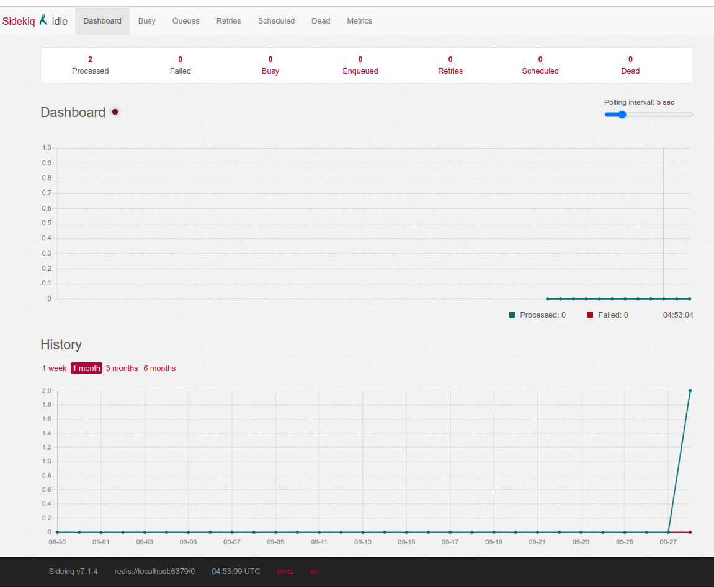
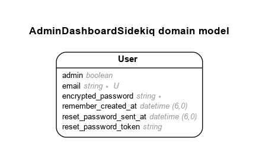

# README

Sidekiq Background Jobs With Admin Dashboard

Following Youtube Guide: https://www.youtube.com/watch?v=fUVTtTVJ_QY



# Model

Generated by Rails ERD. Run rails erd to regenerate (must have graphviz).


# Versions

- ruby 3.2.2 (2023-03-30 revision e51014f9c0) [x86_64-linux]
- Rails 7.0.8

# System dependencies

Redis - https://redis.io/docs/getting-started/installation/install-redis-on-linux/

# Configuration

- If `bin/dev` does not work, try running:
  `$ gem install foreman`
- Kill redis:

```sh
ps aux | grep redis
sudo kill -9 51066
```

- In Procfile.dev add the following:

```
sidekiq: bundle exec sidekiq -C config/sidekiq.yml
```

- Create file `config/sidekiq.yml`
- Create new Sidekiq job: `rails g sidekiq:job hello`. This is create a file app/sidekiq/hello_job.rb.
- Reference the job in the controller as: HelloJob.perform_at(5.seconds.from_now) or HelloJob.perform_async()

# References

- WebUI Monitoring - https://github.com/sidekiq/sidekiq/wiki/Monitoring
